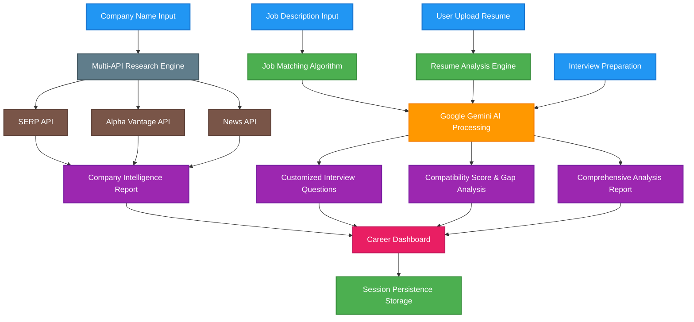

# HireEdge AI - Your AI-Powered Career Strategist

[](https://www.python.org/downloads/)
[](https://streamlit.io/)
[](https://cloud.google.com/ai)
[](LICENSE)

> **Get the competitive edge in your placement season with advanced AI-powered career optimization tools.**

## System Architecture Flow



## What is HireEdge AI?

HireEdge AI is a comprehensive career assistant that gives you the **competitive advantage** in your job search and placement preparation. Unlike generic career tools, HireEdge AI provides:

- **Intelligent Resume Optimization** with AI-powered analysis
- **Real-Time Company Intelligence** using live APIs
- **Smart Job Matching** with compatibility scoring
- **AI-Driven Interview Preparation** tailored to specific roles
- **Persistent Data Management** across all career activities

## Core Features

### Professional Dark Theme UI
- Sleek, modern interface designed for extended use
- Natural scrolling and responsive design
- Compact sidebar with session management

### Advanced AI Analysis
- **Google Gemini 2.5 Flash** integration for intelligent insights
- **Comprehensive HTML cleaning** for pristine output
- **Multi-layered analysis** across all career components

### Complete Session Persistence
- All analyses saved with timestamps
- Cross-section data availability
- Debug storage tracking for transparency

### Real-Time API Integration
- **News API** for latest company updates
- **Adzuna Jobs API** for market insights
- **Alpha Vantage** for financial data
- **SERP API** for comprehensive research

## Quick Start

### Prerequisites
- Python 3.8 or higher
- Google Gemini API key
- Internet connection for API features

### Installation

1. **Clone the repository**
   ```bash
   git clone https://github.com/KshitizCodeHub/HireEdge-AI.git
   cd "HireEdge AI"
   ```

2. **Install dependencies**
   ```bash
   pip install -r requirements.txt
   ```
   
   **Note**: This includes LangChain for AI orchestration and Google Gemini integration.

3. **Set up your API keys**
   Create a `.env` file in the root directory:
   ```env
   GOOGLE_API_KEY=your_gemini_api_key_here
   NEWS_API_KEY=your_news_api_key_here
   ADZUNA_APP_ID=your_adzuna_app_id_here
   ADZUNA_API_KEY=your_adzuna_api_key_here
   ALPHA_VANTAGE_API_KEY=your_alpha_vantage_key_here
   SERP_API_KEY=your_serp_api_key_here
   FINNHUB_API_KEY=your_finnhub_api_key_here
   ```

4. **Launch HireEdge AI**
   ```bash
   streamlit run career_frontend.py
   ```

5. **Open in browser**
   Navigate to `http://localhost:8501`

## Demo & Screenshots

### Application Flow
```
User Journey:
Upload Resume → AI Analysis → Job Description Input → Company Research → Interview Prep → Career Dashboard
     ↓               ↓              ↓                     ↓                 ↓              ↓
   PDF Parse    Gemini AI     Compatibility      Multi-API Fetch    Question Gen   Session Store
```

### Key Capabilities
| Feature | Technology | Output |
|---------|------------|--------|
| Resume Analysis | Google Gemini AI | Detailed feedback, improvement suggestions |
| Company Research | News API + Alpha Vantage | Real-time company insights, financial data |
| Job Matching | AI Compatibility Algorithm | Match percentage, skill gap analysis |
| Interview Prep | Context-aware AI | Customized questions, company-specific prep |
| Data Persistence | Streamlit Session State | Cross-session availability, debug tracking |

## How to Use HireEdge AI

### Resume Optimization
- Upload your resume (PDF or text)
- Get AI-powered analysis and suggestions
- View detailed improvement recommendations

### Job Matching
- Input job descriptions
- Get compatibility scores and gap analysis
- Receive targeted improvement strategies

### Company Intelligence
- Research target companies with real-time data
- Get latest news, financial insights, and market position
- Prepare strategic talking points for interviews

### Interview Preparation
- Generate customized interview questions
- Get behavioral and technical question sets
- Receive company-specific preparation guides

### Career Dashboard
- View all analyses in one place
- Track your preparation progress
- Access comprehensive career overview

## Technical Architecture

```
HireEdge AI
├── career_frontend.py          # Streamlit UI with dark theme
├── career_backend_simple.py    # Core AI logic and API integration
├── advanced_tools.py           # Enhanced tool classes with real APIs
├── requirements.txt            # Python dependencies
└── .env                       # API configuration (create this)
```

### Core Technologies
- **Frontend**: Streamlit with custom CSS
- **AI Engine**: Google Gemini 2.5 Flash
- **APIs**: News, Adzuna, Alpha Vantage, SERP
- **Data Processing**: PyPDF2, pdfplumber for resume parsing
- **Session Management**: Streamlit session state with persistence

## Features Showcase

### Smart Analysis Dashboard
```
HireEdge Complete Career Analysis
├── Resume Strength: 85/100
├── Company Research: 3 companies analyzed
├── Job Matches: 92% compatibility
└── Interview Prep: 15 questions generated
```

### Company Intelligence Sample
```
Google Research Summary
├── Latest News: 5 recent articles
├── Stock Performance: +12.5% YTD
├── Key Insights: AI focus, cloud growth
└── Interview Prep: Strategic talking points
```

### Job Match Analysis
```
Software Engineer @ Google
├── Compatibility Score: 92/100
├── Matching Skills: Python, AI/ML, Cloud
├── Gap Areas: Kubernetes, System Design
└── Recommendations: 3 improvement areas
```

## Configuration Options

### API Keys Setup
All API integrations are optional but recommended for full functionality:

- **Google Gemini**: Required for AI analysis
- **News API**: Company news and updates
- **Adzuna**: Job market insights
- **Alpha Vantage**: Financial data
- **SERP API**: Enhanced search results
- **Finnhub**: Additional financial data (optional)

### Debug Features
- **Storage Information**: Track all saved analyses
- **Session Management**: View cross-section data availability
- **Clear Data**: Reset all session information

## Contributing

We welcome contributions! Please see our [Contributing Guidelines](CONTRIBUTING.md) for details.

### Areas for Contribution
- Additional API integrations
- UI/UX improvements
- New analysis features
- Documentation enhancements

## License

This project is licensed under the MIT License - see the [LICENSE](LICENSE) file for details.

## Support

- **Issues**: [GitHub Issues](https://github.com/KshitizCodeHub/HireEdge-AI/issues)
- **Discussions**: [GitHub Discussions](https://github.com/KshitizCodeHub/HireEdge-AI/discussions)
- **Connect**: [Kshitiz's GitHub Profile](https://github.com/KshitizCodeHub)

## Acknowledgments

- **Google Gemini** for advanced AI capabilities
- **Streamlit** for the amazing web framework
- **LangChain** for AI orchestration tools
- **All API providers** for real-time data access

---

<div align="center">

**HireEdge AI - Your AI-Powered Career Strategist**

*Get the competitive edge in your placement season!*

[](https://github.com/KshitizCodeHub/HireEdge-AI)

</div>